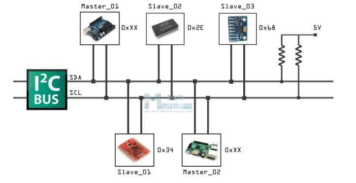
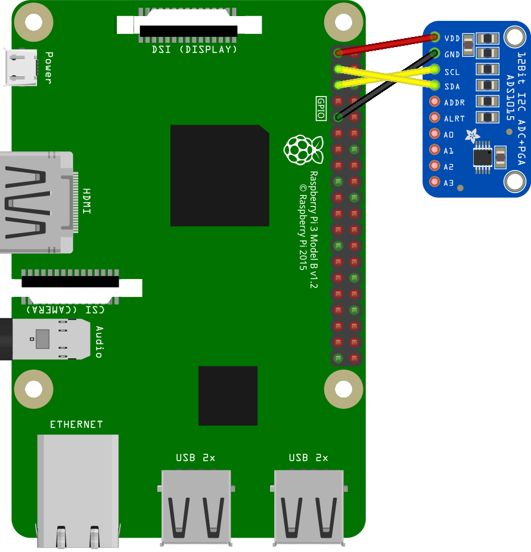

# Sordometro

## Introduccion

Este proyecto nace de nuestra experiencia personal trabajando en el taller y de nuestra infancia en comedores escolares. Estos dos entornos y tantos otro similares que se pueden encontrar en nuestro centro educativo son entornos ruidosos y ajetreados, con posibilidad de llear a dañar nuestro sistema auditivo sin siquiera uno darse cuenta.

Habiendo analizado estos escenarios hemos decidido diseñar y montar un dispositivo que mida el nivel de presion sonora y el tiempo en el que este nivel llegaria a causar daño auditivo, tras conseguir estos datos el dispositivo seria capaz de enseñar los datos en una pantalla, todo en un formato compacto capaz de ser colocado con facilidad en cualquier entorno en el que su uso pueda ser necesitado.

Siendo este dispositivo en su naturaleza un dosimetro sonoro (instumetro de medicion de presion sonora) el cual tambien calcula el daño auditivo, el nombre Sordometro nos parecio adecuado para representar el proyecto.


## Planteamiento

*Este es nuestro link hacia la planificacion (organigrama) que hemos desarrollado https://trello.com/invite/b/8RXYTQzc/c8e4bea1b8927ca968e30a7372cd1c63/sordometro*

El planteamiento inicial del proyecto es sencillo, tenemos una entrada (el microfono) y una salida (la pantalla). Es lo que connecta estos dos componentes y lo que hace que el uno se adapte al otro donde realmente entra lo compliacado del proyecto. 

Dentro del sistema de funcionamento del dispositivo tenemos varios componentes que trabajan a diferentes voltajes y diferenntes tipos de señal. El microfono, por ejemplo, recoge ondas de sonido las cuales al transformarlas a electricidad se convierte en corriente alterna, la cual no podria ser enseñada en una pantalla porque esta usa corriente continua. Este microfono tambien necesita su alimentacion correcta y su circuito adecuado para el optimo funcionamiento. Este seria el primer bloque funcional importante del sistema, que como todo lo mencionado en este planteamiento sera analizado mas en profundidad a lo largo del documento. 


La señal que el microfono genera es despues enviada a un conversor analogico digital (ADS1115) con este chip conseguimos convertir la señal analogica de audio en una señal diital que es luego enviada a una Raspberry PI mediante el protocolo de comunicacion I2C. La Raspberry PI es el segundo bloque funcional del dispositivo junto a la pantalla. La raspberry es la encargada de leer los datos que le llegan del conversor y hacer los calculos de los decibelios y los calulos del daño auditivo gracias a datos previamente analizados en estudios de terceros. Estos datos junto al diseño visual del display han sido programados en java usando el software de programacion grafica Processing 3.5.3


Finalmente teniendo claros todos los componentes del sistema, el ultimo paso seria el de oranizar todo el cableado de una manera sencilla y facil de modificar si fuera necesario, cerrando todo con un chasis impreso en 3D que estaria atornillado a la pantalla.


## Lectura del sonido
Para obtner una buena lectura de datos decidimos hacer nuestra propio microfono electrec con su propia alimentacion a 30V+ para obtener asi el mayor amplitud de onda posible.
Uno de los mayores problemas que tenimos era la alimentacion para sacar los 30v+ de la propia alimentacion de la raspberry pi 4, por lo tanto optamos por poner un step up con una entrada de 5v+ continua proveniente de la raspberry para obtener la salida de 30v+ para nuestra alimentacion del sistema del microfono. La placa consta de unas resistencias en formato smd, concensadores polarizados y no polarizados,un potenciometro para aumentar o disminuir la ganancia, un chip5532, las entradas y salidas de la propia placa y el montaje de la placa que pasa la señal analogica a digital llamada ADS1115

<p align="center">
  
</p>

*Si quiere ver la imagen ampliada haga clic en la imagen para verla a mayor resolucion*

ahora explicaremos cada elemento del esquema electrico.

J1: es la salida SDA y SCl que van hacia la raspberry pi para la lectura y la interpretacion de la señal.

J2: es la entrada de alimentacion 30V+ que alimenta todo el sistema electrico del microfono.

J3: es la entrada del microfono, va conectado junto al chip 5532 para la amplificacion de la señal, tiene un divisor de tensiones para alimentarlo constantemente.

J4: son pines para la colocacion del convertidor analogico digital ADS1115,el pin 1 y 2 son entradas de V y GND, los pines 3 y 4 son para el SCL(Sereial clock)y el SDA(Serial Data).

J5: estos pines son la entrada de 5v+ que necesita el chip ADS1115 para su funcionamiento, si no no llegara a convertir la señal que tenemos, estos 5 voltios tambien provienen de la raspberry pi.

R1 y R2: son el divisor de tensiones que alimenta el microfono, las dos resistencias son de 5k1 ohms para que tenga una alimentacion constante.

R3: es el potenciometro que regula la ganancia de nuestro microfono.

R4: es una resistencia de 4k3 ohms puesta en la entrada negativa para equilibrar la entrada.

R5 y R6: resistencias de carga, solo montarlas en caso de querer inspeccionar la ganancia de salida.

R7 y R8: divisor de tensiones que va hacia el A0 que es la entrada analogica ya para convertirlo en analogico.

C1: condensador de 100uF polarizado, necesario para que el microfono electrec funcione.

C2: condensador de 82pF no polarizado , para controlar la ganancia junto al potenciometro (R3).

C3: condensador de 2uF polarizado , para controlar junto a la resistencia R4 la entrada negativa.

C4: condensador de 5uF polarizado que filtra la señal para obtener el menor tipo de ruido posible despues de amplificar.

U1:A: es el chip 5532, es un chip amplificador dual de bajo ruido especial para sonido, que amplificara nuestra señal.

## Step UP

El step up es un convertidor DC DC que gracias a su circuito podemos aumentar el voltaje de la salida del Step UP consiguiendo asi que los 5 voltios que tenemos de la raspberry se combiertan en los 30 voltios que necesitamos.

El step up que utilizaremos sera el XL16009, es el modelo mas novedoso en el mercado, tiene un amplitud de entrada de 3 a 30V y una salida de 5 a 35V

<p align="center">
  
</p>

<p align="center">
  
</p>

*si quieres ver la imagen en un mejor resolucion haz click en la imagen*

como se puede ver en la parte de la izquierda esta la entrada de señal y a la derecha esta la salida de la señal ya aumentada

## Rasperry PI y Display

Lo primero de todo es conectar la pantalla a la raspberry, es un proceso simple ya que se requieren tres cables. Gracias a la fuente de alimentacion que viene con la pantalla y el cable USB la raspberry se alimenta directamente con la pantalla. A demas de esto solo requerimos un cable HDMI y la fuente de alimentacion de 12V de la pantalla  todo lo demas serian perfiericos necesarios para la programacion de la raspberry, como un teclado, el SUB del apartado tactil de la pantalla,   raton y cable ethernet.

Para entender como llegan los datos a la raspberry es importante entender tambien que es la comunicaccion I2C y como funciona esta:

I2C o IIC (Circuito Inter-Integrado) es un protocolo de comunicaion el cual su proposito prinipal es conectar varios componentes de una red de dispositivos electronicos para que trabajen entre si. Este sistema se oraniza de tal manera: hay un componente meastro el qual es quien manda en la comunicacion. Este componente, normalmente microcrontroladores y micrordenadores, es el encargado en dar las ordenes de que informacion, de quien, cuando y a que velocidad se envia en el protocolo de comunicacion. El otro componente es el esclavo, el cual puede ser un sensor un microcontrolador e incluso otro micrordenador. El esclavo trabaja a merced del maestro, cuando este le ordena que envie un dato el esclavo lo hace. Este sistema puede estar formado por varios maestros y varios esclavos al mismo tiempo, la comunicacion se transmite con dos puertos el SDA (Serial Data) y el SCL (Serial Clock). Estos puertos a los cuales los componentes son conectados son los que hacen que el sistema funcione, el SDA es el puerto que recibe los datos del esclavo y los conduce al maestro, el SCL es un clock que determina la velocidad y el formato de la comunicacion, asurandose de que se adapte la velocidad a la ordenada por el maestro. En la foto que se observa a continuacion se puede apreciar una conexion estandar de un sistema i2c: 

<p align="center">
  
</p>

Sabiendo la teoria del protocolo I2C estos serian los pasos para configurarla en la Raspberry PI, teniendo en cuenta que tenemos una raspberry iniciada desde cero:

·Lo primero seria activar los puertos I2C de la raspberry, para esto usamos el comando ```sudo raspi-config``` en el terminal. Despues bajamos hasta ```Interface Options```, aqui seleccionamos ```I2c``` y le damos a ```Yes``` tras esto reiniciamos la raspberry.

·Una vez teniendo la interfaz I2C activada tenemos que instalar un par de utilidades de la raspberry, para eso insertamos en el terminal los siguientes dos comandos:
```
  sudo apt-get install -y python-smbus
  sudo apt-get install -y i2c-tools
```
  Reiniciamos el sistema con ```sudo reboot```.
  
·Ahora tenemos que conectar el conversor ADS1115 a la raspberry siguiendo el siguiente esquema:

<p align="center">
  
</p>

  EL conversor puede tener 4 direcciones distintas, podemos cambiar las direcciones conectando el puerto ADDR a los puertos del mismo conversor de GND, VDD, SCL o SDA. Estas       direcciones aparecerian en la raspberry con el siguiente nombre: 0x48, 0x49, 0x4B y 0x4A en su respetcivo orden, siendo 0x48 la direccion por defecto si no conectamos nada al   pin ADDR.
  
 ·Para comprobar si la raspberry esta leyendo nuestro conversor ejecutamos el siguiente comando en el terminal: ```i2cdetect -y 1```. Siendo el siguiente el resultado:


 ```
  pi@raspberrypi ~ $ *i2cdetect -y 1 
      0  1  2  3  4  5  6  7  8  9  a  b  c  d  e  f 
 00:          -- -- -- -- -- -- -- -- -- -- -- -- -- 
 10: -- -- -- -- -- -- -- -- -- -- -- -- -- -- -- -- 
 20: -- -- -- -- -- -- -- -- -- -- -- -- -- -- -- -- 
 30: -- -- -- -- -- -- -- -- -- -- -- -- -- -- -- --          
 40: -- -- -- -- -- -- -- -- 48 -- -- -- -- -- -- -- 
 50: -- -- -- -- -- -- -- -- -- -- -- -- -- -- -- -- 
 60: -- -- -- -- -- -- -- -- -- -- -- -- -- -- -- -- 
 70: -- -- -- -- -- -- -- -- 
 
 ```

  Aqui se pueden onbservar todas las direcciones posibles del protocolo I2C que puede leer la raspberry, el numero 48 que se puede apreciar representa correctamente a nuestro conversor ADS1115.
  
  
 ### Preparacion Processing
 
 Para instalar Processing en nuestro sistema Raspberry primero de todo tenemos que saber cual es la ultima version disponible, en nuestro caso la 3.5.3. Sabiendo esto, ejecutamos los siguientes comandos en el terminal de la raspberry.
 ```
 cd ~
wget http://download.processing.org/processing-3.5.3-linux-armv6hf.tgz
 ```
 
Una vez instalado lo extraemos:
```
tar xvfz processing-3.0.1-linux-armv6hf.tgz
```

Para iniciar un sketch de Processing ejecutamos los siguientes comandos:

```
cd ~/processing-3.0.1/
./processing
```

Ahora para configurar nuestro conversor ADS1115 añadimos la libreria Hardware I/O, con esto tendriamos a nuestra disposicion en ```Ejemplos -> Librerias Principales -> Hardware I/O -> AnalogDigital_I2C_ADS1115```

Con este programa somos capaces de confiurar nuestro conversor, a continuacion voy a mostrar el codigo completo pero solo explicare lo que hay que modificar: 

```

    if (channel != this.channel) {
      int config = 0x0183;                    // start with the default value from datasheet
      config &= ~0x100;                       // enable continuous readings
      config |= (range << 9);                 // set selected range (gain)
      config |= (1 << 14) | (channel << 12);  // set single-ended and channel
      config |= (1 << 15);                    // start a single conversion
      writeRegister(0x01, config);            // write to the configuration register at 0x01

      // when the channel switched we need to wait for the upcoming
      // conversion to finish
      delay(conversionDelay);

      // save the channel so that we don't need to do the same for
      // subsequent reads from the same channel
      this.channel = channel;
    }

    return readS16(0x00) >> bitShift;  // read from the conversion register at 0x00
    // the ADS1015 will have its 12-bit result in the upper bits, shift those right by four
  }

  protected void writeRegister(int register, int value) {
    beginTransmission(address);
    write(register);
    write(value >> 8);
    write(value & 0xFF);
    endTransmission();
  }

  protected int readS16(int register) {
    beginTransmission(address);
    write(register);
    byte[] in = read(2);
    return (in[0] << 8) | in[1];
  }
}
```

  Aqui lo unico que tenemos que modificar serian los valores del config, de esta manera podemos modificar los primeros bits que son los de confiuracion fijandonos en el datasheet: https://www.ti.com/lit/ds/symlink/ads1115.pdf?ts=1612940066789&ref_url=https%253A%252F%252Fwww.google.com%252F. Lo otro que es necesario cambiar es la ultima linea, aqui se especifica como tienen que ser leidos los bits. En nuestro caso queremos leer dos bytes, para esto lo especificamos poniendo un dos dentro del read en la siguiente linea: ```byte[] in = read(2);```. Como los bytes entran a la par a la hora de leerlos, hay que mover el primer byte 8 bits para la izquierda para que asi se convierta en un dato de 16 bits, esto lo hacemos en la ultima linea del codigo: ``` return (in[0] << 8) | in[1]; ```.
  
  
  Este seria la segunda parte del programa donde se llama a la lectura de los datos, aqui hay que fijarse en la creacion del objeto, por defecto est el ADS1015, este es otro chip compatible con el programa. Tenemos que deseleccionar esa creaccion de objeto y seleccionar la del ADS1115 que ya esta escrito. A demas en la misma llamada al objeto se puede cambiar la direccion, por defecto esta la de 0x48 que seria la que tambien viene por defecto en el conversor:
  
  ```
  //ADS1015 adc;
// or, alternatively:
ADS1115 adc;

// see setup.png in the sketch folder for wiring details

void setup() {
  //printArray(I2C.list());

  //adc = new ADS1015("i2c-1", 0x48);
  adc = new ADS1115("i2c-1", 0x48);

  // this sets the measuring range to +/- 4.096 Volts
  // other ranges supported by this chip:
  // INTERNAL_6V144, INTERNAL_2V048, INTERNAL_1V024,
  // INTERNAL_0V512, INTERNAL_0V256
  adc.analogReference(ADS1X15.INTERNAL_4V096);

  // Important: do not attempt to measure voltages higher than
  // the supply voltage (VCC) + 0.3V, meaning that 3.6V is the
  // absolut maximum voltage on the Raspberry Pi. This is
  // irrespective of the analogReference() setting above.
}

void draw() {
  // this will return a number between 0 and 1
  // (as long as your voltage is positive)
  float measured = adc.analogRead(0);

  // multiply with the selected range to get the absolut voltage
  float volts = measured * 4.096;
  println("Analog Input 0 is " + volts + "V");

  background(255);
  fill(measured * 255);
  ellipse(width/2, height/2, width * 0.75, width * 0.75);
}
  ```

Este programa esta preparado para leer n potenciometro, lo importante aqui seria determinar el intervalo de lectura que se hace cambiando el nombre del intervalo en la funcion ```   adc.analogReference(ADS1X15.INTERNAL_4V096); ```. A demas de esto la funcion mas importante y la que vamos a utilizar mas tarde en nuestro proyecto es la siguiente ``` float measured = adc.analogRead(0); ```.

### Programacion del Sordometro


Esta es la version final del programa.
Puede variar el valor de la variable N_muestras segun la capacidad del dispositivo.
Pueve variar el valor de V2 para calibracion de los decivelios captados


```
import processing.io.*;//importa biblioteca de prcessing en el programa
ADS1115 adc;//crea variable abc de la familia de la biblioteca
//variables de array Muestro_de_V1
float i=0;
int N_muestras=500;
int turn=0;
int muestra=0;
float[] array_muestras=new float [N_muestras] ;//array es un conglomerado de variables
float V1=0;//valor medio de la señal de entrada
//variable actualizable de señal de entrada
float measured=0;
//variables para calculo de DB (pot)
float suma=0;
//V1 se encuentra en variables de array Muestre_de_v1
float V2=7;
float pot=0;
//variables de interfaz
PFont tex;
float H=0;
int hora1=0;
int min1=0;
int hora2=0;
int min2=0;
float red1=0;
float green1=255;
float red2 =255;
float green2 =0;
float minutosreales;
float uno=0.7937;
float mi =second()+(minute()*60)+(hour()*3600);
float si=0;
float porciento=1;
int escaneo=0;
//var de acumulador
float TiempoR;
long s=millis();
float T=1;
float porcentagerestante=1;
float r=1;
//control de tiempointervalo
void setup() {
  fullScreen();//pantalla completa
  //size(1280, 800);
  colorMode(RGB, 100);//funcion de color en rgb para facilitar los calculos
  printArray(PFont.list());//añadir lista de fuentes
  tex= createFont("Cambria-Bold-48.vlw", 48);//escoger fuente
  textFont(tex);// utilizar fuente escogida en siguientes textos

  //revovinado de medias a 110 para poder hacer los calculos del principio

  for (int revovina=N_muestras; revovina<=1; revovina--) {
    array_muestras[revovina]=110;
    revovina--;
  }


  adc = new ADS1115("i2c-1", 0x48);

  // this sets the measuring range to +/- 4.096 Volts
  // other ranges supported by this chip:
  // INTERNAL_6V144, INTERNAL_2V048, INTERNAL_1V024,
  // INTERNAL_0V512, INTERNAL_0V256
  adc.analogReference(ADS1X15.INTERNAL_6V144);

  // Important: do not attempt to measure voltages higher than
  // the supply voltage (VCC) + 0.3V, meaning that 3.6V is the
  // absolut maximum voltage on the Raspberry Pi. This is
  // irrespective of the analogReference() setting above.
}

void draw() {

  measured = adc.analogRead(0);
  s=millis();
  //recoge medidas para utilizar mas adelante
  Muestreo_de_V1();
  //superpone las partes estaticas del fondo para crear la estetica deseada
  fondo_estatico();
  //combersor de DBSPL (DBA) en tiempo
  curvasimple();
  //combertidor del tiempo directo restante y mostrarlo apropiadamente
  exposicionrestante();
  //acumulador sonoro para exposicion sertante en jornada
  acumulador();
  //combertidor del tiempo acumulado restante y mostrarlo apropiadamente
  mostraracumulador();
  //muestra la peligrosidad en tonos de color de verde a rojo tiñiendo los numeros
  colores();
}
void Muestreo_de_V1() {
  if (measured<0) {//si la varible de entradad de datos es negativa rectificalo a positivo
    measured=-measured;
  }
  if (turn<N_muestras) {//cargame el nuevo valor en el array
    array_muestras[turn]=measured;
    for (int w=0; w<N_muestras; w++) {//empieza el calculo de la media geometrica del array
      i+=pow(array_muestras[w], 2);
    }
    V1=sqrt(i/N_muestras);
    i=0;
    pot= 20*(log(V1/V2));

    turn=turn+1;//termina el calculo de la media geometrica
  }
  if (turn>=N_muestras) {
    turn=0;
  }
}


void exposicionrestante() {
  int db=round(pot);//redondea lossin decimales decibelios para poder displayarlo 
  textSize(100);//tamaño de texto
  fill(red1, green1, 0);//color controlado con la funcion de color
  text("DB=  "+db, 180, 255);
  //empieza a mostrar las variables de tiempo de manera exadecimal
  if (H<=1) {//limite inferior a 0
    fill(red1, green1, 0);
    textSize(50);
    minutosreales=H*60;
    min1=round(minutosreales);
    text(min1+"min", 970, 235);
    hora1=0;
    text(hora1+"H", 880, 235);
  }
  if ((H>1)&&(H<48)) {//rango funcional entr 1 segundo y 48
    hora1=round(H-0.5);
    fill(red1, green1, 0);
    textSize(50);
    text(hora1+"H", 880, 235);
    minutosreales=(H*60)-(hora1*60);
    min1=round(minutosreales);
    text(min1+"min", 970, 235);
  }
  if (H>48) {//limite superior 
    fill(red1, green1, 0);
    textSize(50);
    text("SIN RIESGO", 845, 235);
  }
}
void fondo_estatico() {
  background(0, 0, 0);
  //rectangolo arriba1
  strokeWeight(5);
  fill(0, 0, 30);
  stroke(80, 80, 100);
  rect(130, 100, 650, 230, 17);
  //rectangolo arriba2
  strokeWeight(5);
  fill(0, 0, 30);
  stroke(80, 80, 100);
  rect(830, 100, 320, 230, 17);
  //rectangulo abajo
  strokeWeight(5);
  fill(0, 0, 30);
  stroke(80, 80, 100);
  rect(130, 430, 1015, 230, 17);
  //Descripciones
  textSize(30);
  fill(80, 80, 100);
  text("SONÓMETRO", 365, 380);
  textSize(18);
  text("TIEMPO DE EXPOSICION", 895, 370);
  text("DIARIA MAXIMA", 925, 400);
  textSize(30);
  text("DOSIMETRO SONORO:", 180, 710);
  textSize(18);
  text("TIEMPO DE EXPOSICION RESTANTE PARA LA PERDIDA DE AUDICION", 520, 708);
}
void curvasimple() {//curca de combersion de DBSPL a TIEMPO
  float uno=0.7937;
  uno=pow(0.7937, pot);
  H=(2705659839.93267* uno);
  r=H*3600;
}
void acumulador() {
  /*
  acumula el tiempo de exposicion restante en relacion al tiempo de exposicion adquirido
Cada retardo X de tiempo actualiza el valor del porcentage que tiene que mostrar en pantaya
*/
  if (si<s-900) {
    if (T>0) {//limite de 0 minutos, no puede quedar nenos tiempo que 0
      println(T);
      T=1/(r);
      porcentagerestante-=T;
    }
    si=s; //actualiza el tiempo para que el retardo se repita en cada ejecucion
  }
  
}
void mostraracumulador() {// calculo para mostrar el tiempo restante de exposicion diaria
  TiempoR=(r*porcentagerestante);
  fill(red2, green2, 0);
  textSize(130);
  if (TiempoR<=0) {//limite de 0
    hora2=0;
    text(0+"H", 390, 590);
    min2=0;
    text(0+"min", 620, 590);
  }
  if ((TiempoR>0)&&(TiempoR<356400)) {//rango operativo
    hora2=round((TiempoR/3600)-0.5);
    text(hora2+"H", 370, 590);
    min2=round(TiempoR/60);
    text((min2-(hora2*60))+"min", 620, 590);
  }

  if (TiempoR>356400) {//limite superior
    hora2=99;
    text(99+"H", 370, 590);
    min2=59;
    text(59+"min", 620, 590);
  }
}
void colores() { //funciones de color diferentes para cadada peligrosidad, los marcadores de tiempo
  red1=255-(H*15);
  green1=(H*15);
  red2=255-((TiempoR/3600)*15);
  green2=((TiempoR/3600)*15);
}

```

### Componentes y Precio

| Componente | Cantidad | Precio |
| ------------- | ------------- | ------------- |
| Raspberry PI Model 4 8gb  | 1  | 9,87 €€  | 
| MissBirdler Step-up Boost XL6009 | 1  | 85,95€  | 
| resistencia smd 5k x3  | 1  | 0,05€  |
|  resistencia smd 4k  |  1 |  0,05€ |
| resistencia smd 12k  |  1 |  0,05€ |
|  condensador 100uf | 1  |  0,23€ |
|  condensador 2uf |  1 | 0,18€  |
| condensador 5uf  |  1 |  0,18€ |
| chip 5532  |  1 |  0,88€ |
| ads 1115  |  1 | 17,59€  | 
|  microfono electret |  1 | 0,63€| 
|  Micro SD NETAC 64gb | 1  | 11,99 € |
| Display SunFounder 10.1'' | 1  | 149 € |
|  Total| --- | 276,66 € |


### Agradecimientos

Este ha sido un proyecto muy bonito, dificil pero eso lo ha hecho entretenido. Damos gracias a nuestro tutor Xabier Izquierdo, al resto de profesores que forman parte de Mantenimiento electronico de Don Bosco y a Don Bosco como tal por proveernos con los medios necesarios para llevar el proyecto a cabo.


